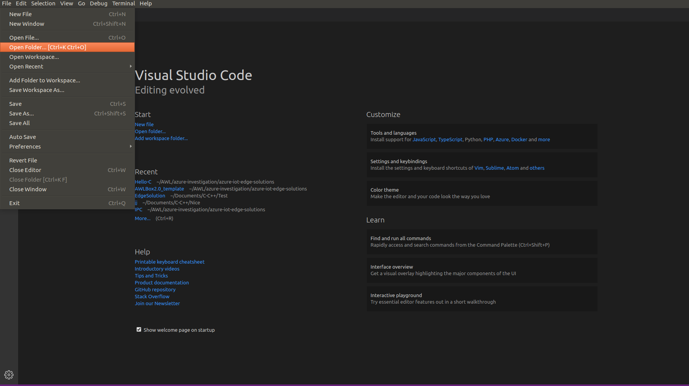
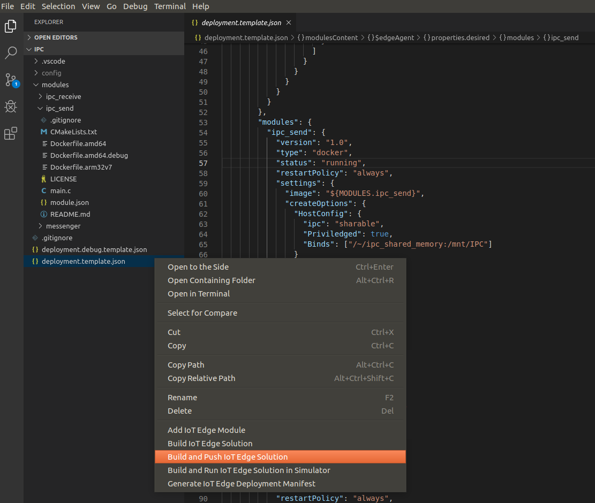

#  Inter-process communication utilizing TCP/IP for Address Sharing

This solution demonstrates how to establish shared memory inter-process communication between two Azure IoT edge modules.

In this implementation, one module writes to memory and then sends the address of the memory segment to the second module via an Azure IoT Edge  TCP/IP route. The second module receives the memory address and uses it to retrieve the contents written to memory by the first module.

The modules solution featured here was written in C with Linux based modules.

__________________________________________________________________________________________
## Deploying this template with Visual Studio Code
The easiest way to create modules outside the Azure portal is by using Visual Studio (VS) Code configured with the [Azure IoT Tools](https://marketplace.visualstudio.com/items?itemName=vsciot-vscode.azure-iot-tools). VS Code handles everything needed to create and push edge modules such as management of credentials, target device specification, images etc. One can also use Azure IoT Hub SDKs with the module client to create modules but this mini guide will focus on VS Code.
### Tooling
You need the following dev tools to do IoT Edge development in general, to make this sample run and edit it:
- **Visual Studio Code**: IoT Edge development environment. [Download it from here](https://code.visualstudio.com/).
- **Visual Studio Code: Azure IoT Edge Extension**: An extension that connects to your IoT Hub and lets you manage your IoT Devices and IoT Edge Devices right from VS Code. A must-have for IoT Edge development. [Download it from here](https://marketplace.visualstudio.com/items?itemName=vsciot-vscode.azure-iot-edge). Once installed, connect it to your IoT Hub.

>To learn more about this development environment, check out [this tutorial](https://docs.microsoft.com/en-us/azure/iot-edge/how-to-deploy-modules-vscode) and [this video](https://www.youtube.com/watch?v=C5eTQ1cwlLk&t=1s&index=35&list=PLlrxD0HtieHh5_pOv-6xsMxS3URD6XD52):

- **Other prerequisites**: Check here for [Linux](https://docs.microsoft.com/en-us/azure/iot-edge/tutorial-develop-for-linux#prerequisites) and here for [Windows](https://docs.microsoft.com/en-us/azure/iot-edge/tutorial-develop-for-windows#prerequisites)

### To deploy the solution
1. Clone this sample
2. open the sample in VS code. 
3. To build the entire solution go to the Visual Studio Code explorer, right-click the deployment.template.json file and select 'Build and Push IoT Edge Solution'.

Note: This can also be achieved by opening the control palette (Ctrl+Shift+P), select `Build and push IoT Edge Solution` (this can take a while...especially to build numpy and pillow...) and select the `deployment.test-amd64.template.json` manifest file (it includes a test video file to simulate a camera)
4. Deploy the solution to your device by right-clicking on the `config/deployment.json` file, select `Create Deployment for Single device` and choose your targeted device
5. Monitor the messages being sent to the Cloud by right-clicking on your device from the VS Code IoT Edge Extension and select `Start Monitoring D2C Message`

Note: To stop Device to Cloud (D2C) monitoring, use the `Azure IoT Hub: Stop monitoring D2C messages` command from the Command Palette (Ctrl+Shift+P).
